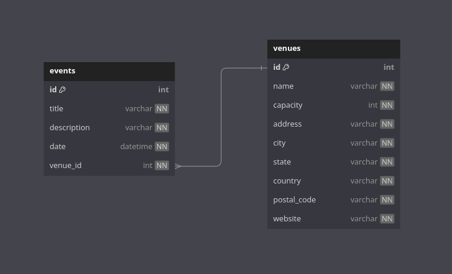

# Liberfly - Teste Situcional Back End v2
*Aplicação desenvolvida para a etapa de conhecimentos técnicos da Liberfly.*

## Introdução
Trata-se de uma RESTful API simples desenvolvida com PHP 8.3 Laravel 11, MySQL 9, Docker, PHPUnit 11 e Scribe.
A aplicação apresenta um relacionamento de duas entidades: Event e Venue.
Essas entidades representariam eventos (shows, concertos, peças, etc) e estabelecimentos (casas de shows, teatros, estádios, etc).
Um evento necessita de estabelecimento pra ocorrer e um estabelecimento pode receber diversos eventos.

## Metodologia de desenvolvimento
Optei por evitar muitas abstrações e utilizar as convenções do framework onde foi possível, como por exemplo:
- Nomeação de Models/Relacionamentos/Migrations
- Resource Controllers
- Route Model Binding
- Form Requests
- Factories
- Seeders

OBS: Seria possível utilizar uma arquitetura mais robusta/flexível e padrões mais rebuscados,
porém para o cenário de um CRUD acredito que seria contraproducente.

## Features:
- Autenticação com JWT
- Testes automatizados de integração
- Aplicação conteinerizada
- Documentação semi-automática no formato OpenAPI/Swagger

## Ambiente de desenvolvimento via Docker

Requisitos:
- Git
- Docker

Instruções:
1. `git clone https://github.com/davisenra/liberfly-app`
2. `cd liberfly-app`
3. `cp .env.example .env`
4. `docker compose build --no-cache`
5. `docker compose up -d`
6. `docker compose exec app composer install`
7. `docker compose exec app php artisan key:generate`
8. `docker compose exec app php artisan jwt:secret`
9. `docker compose exec app php artisan jwt:generate-certs`
10. `docker compose exec app php artisan migrate:fresh`
11. `docker compose exec app php artisan db:seed`
12. `docker compose exec app php artisan scribe:generate`

- Se tudo ocorreu corretamente a aplicação deve estar disponível em `http://localhost:8000`.
- O seeder irá gerar um usuário de testes com email `test@example.com` e senha `password`, o mesmo pode ser usado para obter um token JWT e testar manualmente os endpoints.
- Os endpoints estarão documentados em `http://localhost:8000/docs`

## Suíte de testes
1. `docker compose exec app php artisan tests`
